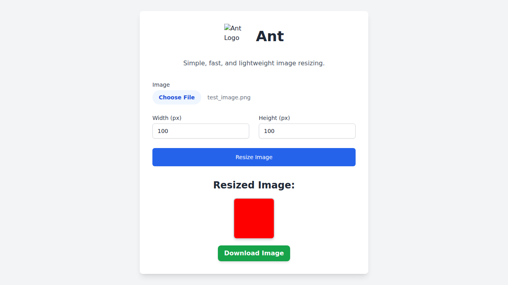

# 🐜 Ant - Simple Image Resizer

Ant is a lightweight image resizing tool built with **FastAPI** and **Pillow**.
It comes with a beautiful and responsive HTML frontend that lets you upload and resize images in seconds.

## ✨ Features
- **Modern & Responsive UI**: Built with Tailwind CSS, the UI looks great on all devices.
- **Upload any image**: Supports PNG, JPG, and other common formats.
- **Resize to any width/height**: Easily specify the dimensions you need.
- **Instant Preview**: See the resized image immediately.
- **Download**: Get your resized image with a single click.
- **Lightweight**: No heavy frameworks, just FastAPI and Pillow.

## 📸 Screenshot



*A screenshot of the new and improved user interface.*

## 🚀 Usage

1.  **Install the dependencies:**
    ```bash
    pip install -r requirements.txt
    ```
2.  **Run the application:**
    ```bash
    uvicorn main:app --reload
    ```
3.  **Open your browser** and navigate to `http://127.0.0.1:8000`.

## 📦 Installation

To run the project locally, you need Python 3.7+ and pip installed.
```bash
pip install -r requirements.txt
```
